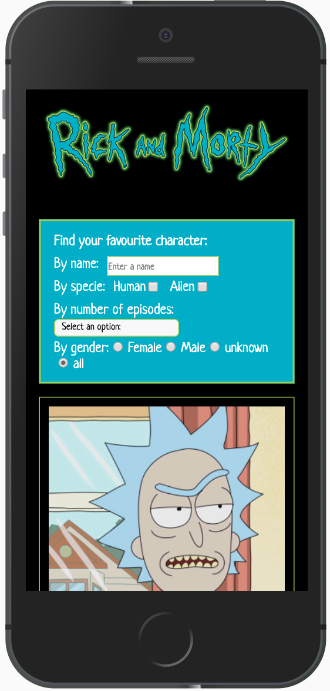
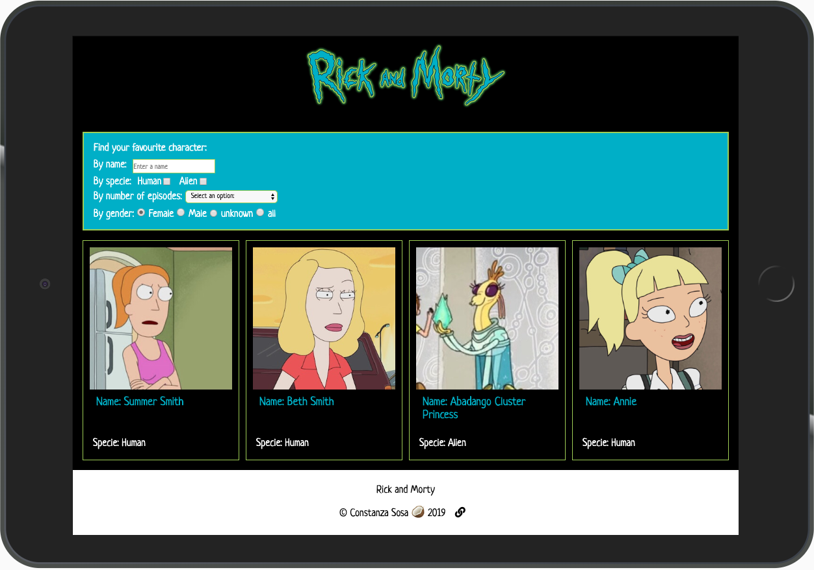

# Ricky and Morty Directory 

This is my final evaluation of the third and last module of @Adalab's Bootcamp. 

It was made with React (Using components, Proptypes and Router), CSS Grid and Sass; following a mobile-first approach.

### Mobile:

### Ipad: 

### Web:

-----------------------------------------------------------------------------------------------------
This project was bootstrapped with [Create React App](https://github.com/facebook/create-react-app).

### Available Scripts

In the project directory, you can run:

#### `npm start`

Runs the app in the development mode. 
Open [http://localhost:3000](http://localhost:3000) to view it in the browser.

The page will reload if you make edits. 
You will also see any lint errors in the console.

#### `npm run build`

Builds the app for production to the `build` folder. 
It correctly bundles React in production mode and optimizes the build for the best performance.

The build is minified and the filenames include the hashes. 
Your app is ready to be deployed!

See the section about [deployment](https://facebook.github.io/create-react-app/docs/deployment) for more information.

